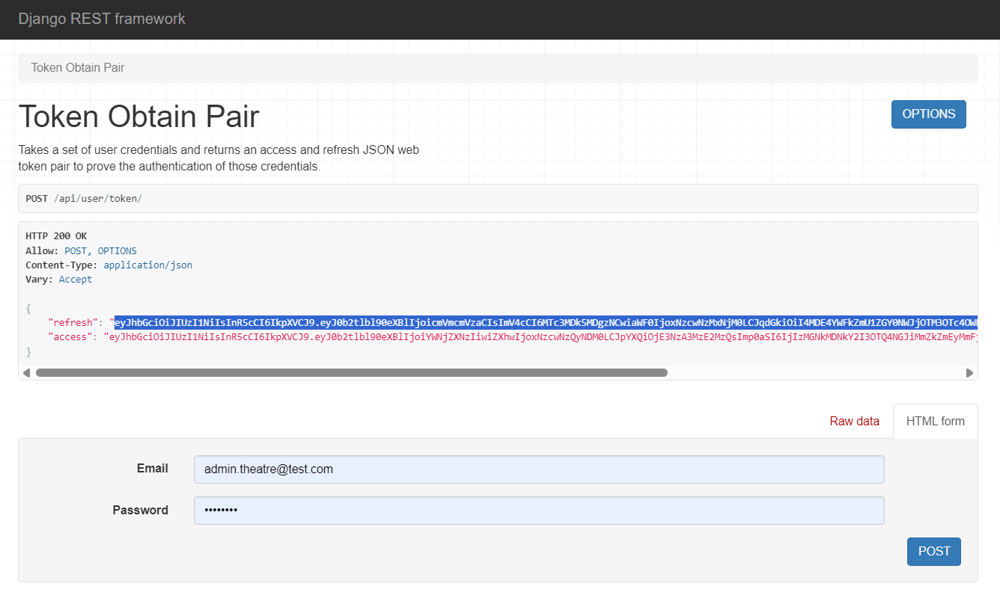
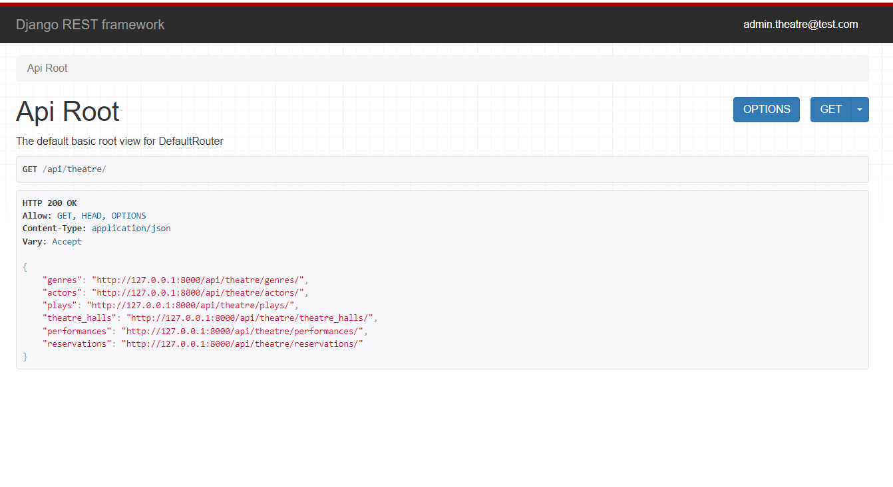
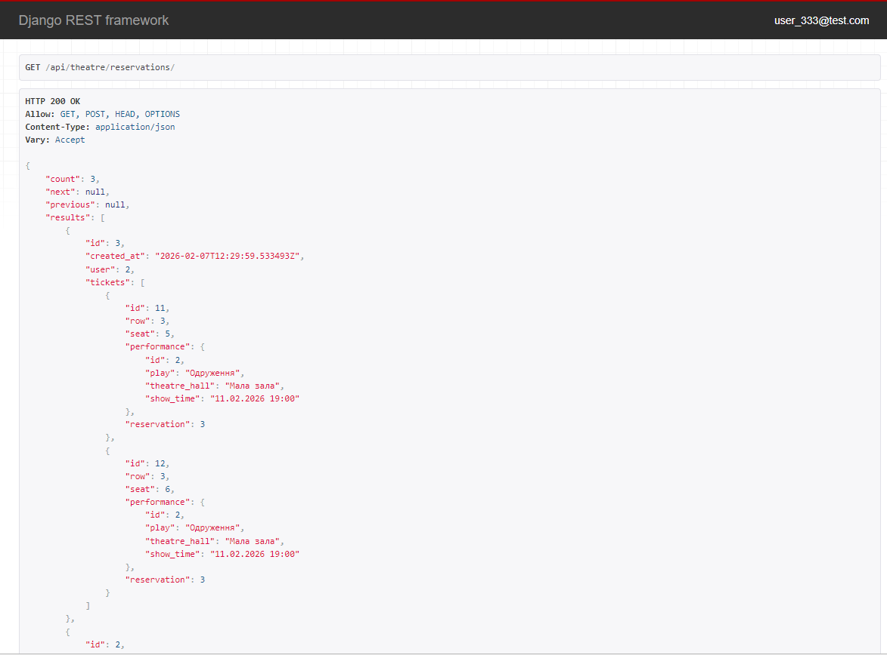
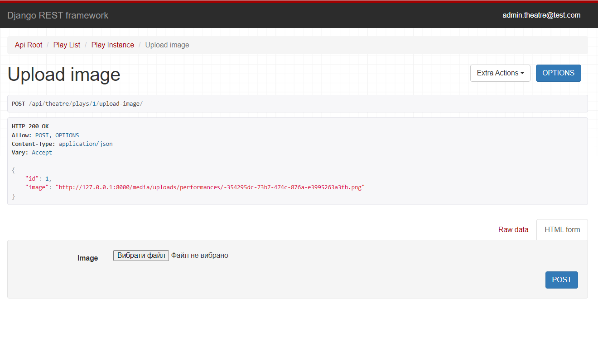
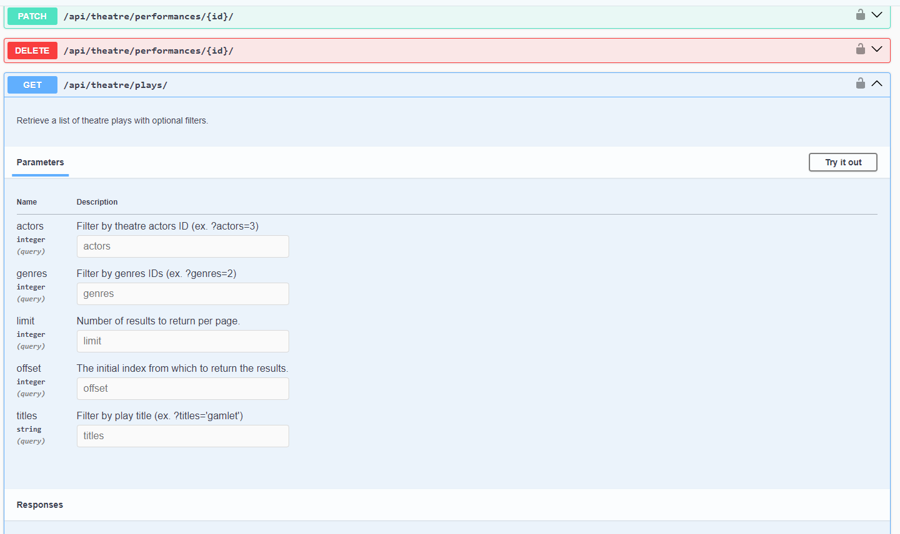

# 🎭 Theatre API

REST API for an online theatre system: manage performances, book tickets, view actors, and users.
The project is built with Django Rest Framework, using PostgreSQL in Docker containers.

---

## 🚀  Technologies

- Python 3.13  
- Django 6 + DRF  
- PostgreSQL 16 (Docker)  
- JWT Authentication (`djangorestframework-simplejwt`)  
- Swagger / Redoc Documentation (`drf-spectacular`)  
- Debug Toolbar  
- Docker + Docker Compose  

---

## 📦  Installation & Setup

### 1. Clone the repository

git clone https://github.com/Luchnick112/py-theatre-api.git
cd py-theatre-api
pip install -r requirements.txt
python manage.py makemigrations
python manage.py migrate

---

### 2. 📀 Create .env file

 In the project root, create an .env file with the following content:
```
POSTGRES_PASSWORD=your_password 
POSTGRES_USER=your_user 
POSTGRES_DB=your_db 
POSTGRES_HOST=db 
POSTGRES_PORT=5432 
PGDATA=/var/lib/postgresql/data 
SECRET_KEY=your_secret_key 
```

---

###  3. ▶️ Run the project in Docker

docker-compose build
docker-compose up

After startup, the API will be available at:
👉 http://127.0.0.1:8000

---

### 4. ‍💻 Create a superuser

 After the first run:

docker-compose exec app python manage.py createsuperuser

 Then you can log into the admin panel:
👉 http://127.0.0.1:8000/admin

---

### 5. 🧾 API Documentation

Swagger UI → http://127.0.0.1:8000/api/doc/swagger/

Redoc → http://127.0.0.1:8000/api/doc/redoc/

---

### 6. 🔑 Test User Credentials

For testing purposes, you can use the following credentials:

Username: user_333
Password: user_333

---

### 7. Demo






